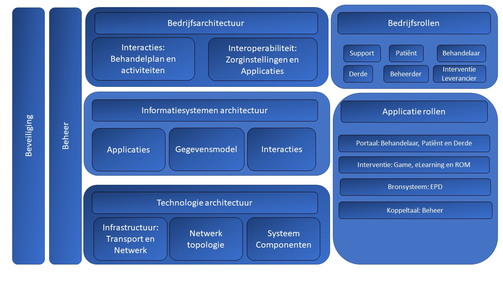

# Koppeltaal 1.3.x architectuur

## Doel en aanleiding

### Doel en scope

Dit document beschrijft de bedrijfsarchitectuur van Koppeltaal GGZ versie 1.3.x. Dit document is opgesteld onder verantwoording van VZVZ. De scope is een beschrijving van de architectuur op ‘Enterprise Architectuur’ niveau, waarbij het TOGAF-raamwerk, en de Architectuur Development Methode \(ADM\) zoveel mogelijk gebruikt worden als taal voor vastlegging van de architectuur.

### Leeswijzer

Dit architectuurdocument is bedoeld voor VZVZ om vragen te kunnen beantwoorden over huidige mogelijkheden en beperkingen van Koppeltaal en dient als basis voor eventuele uitbreiding van functionaliteiten. Het document bevat eveneens \(verwijzingen naar\) standaarden die door GGZ-instellingen en ICT-leveranciers voor die instellingen voor behandelprocessen en de daarbij behorende gegevensuitwisseling.

De architectuurbeschrijving is onder te verdelen in drie secties, namelijk de ‘Bedrijfsarchitectuur’, de ‘Informatiesystemen architectuur’ en de ‘Technologie architectuur’.

### Eenheid van taal

De architectuur van Koppeltaal GGZ heeft zich over de afgelopen vier jaar ontwikkeld op basis van de visie op architectuur die aan de start van het project in 2014 ontwikkeld is. Gedurende die vier jaar is er veel gebeurd en zijn er steeds meer GGZ-aanbieders aangesloten binnen de complexe en multidisciplinaire 'sector' die de GGZ is. Gedurende dezelfde periode heeft de informatie-uitwisseling in de zorg een grote ontwikkeling doorgemaakt. Voorbeelden zijn het programma MedMij, de nieuwe GGZ, Positieve gezondheid, het informatieberaad, en de wereldwijde adoptie van FHIR. De invloed van deze ontwikkelingen, en veranderingen hebben geleid tot een diversiteit van gebruik van begrippen binnen Koppeltaal.

## Koppeltaal

### Geestelijke zorgverlening, blended care en behandelplan

Koppeltaal integreert informatiestromen uit eHealth-modules, ROM en EPD in de werkomgeving van de behandelaar en cliënt. Zo heeft de behandelaar direct een volledig en actueel beeld van hun cliënt in één omgeving. Daarnaast is het mogelijk voor behandelaren om hun cliënten toegang te geven tot specifieke eHealth-modules en interventies van uiteenlopende leveranciers. 

Interoperabiliteit tussen de informatiesystemen is hier één van de belangrijke aspecten in de context van **blended care in de GGZ**. Bij blended care in de GGZ worden reguliere face-to-face gesprekken gecombineerd met **online interventies** zoals bijvoorbeeld chat, beeldbellen en **online behandelmodules**. Hierdoor kan een cliënt tijd- en plaats-onafhankelijk zorg gebruiken via een tablet of smartphone.

Een **behandelplan** beschrijft de gehele behandeling waar een blended care behandeling onderdeel van kan zijn. In dat plan worden verschillende **activiteiten** benoemd, veelal in een bepaalde volgorde. Deze activiteiten kunnen zijn, het samenstellen van het zorgteam, het bepalen van de doelen van een behandeling, het maken van een afspraak, het uitvoeren van een \(online\) interventie, het bespreken of bekijken van **voortgang**, **status**, **resultaten**, en het **evalueren** van de vooruitgang van de conditie van de Cliënt ten opzichte van de behandeldoelen. Voor zover deze activiteiten door een informatiesysteem worden ondersteund, is gegevensuitwisseling via Koppeltaal mogelijk.

Bij een blended care behandeling zijn tenminste een **cliënt** en een **behandelaar** betrokken. En steeds vaker ook **derden**, zoals vrienden, familie, lotgenoten, en ervaringsdeskundigen.

