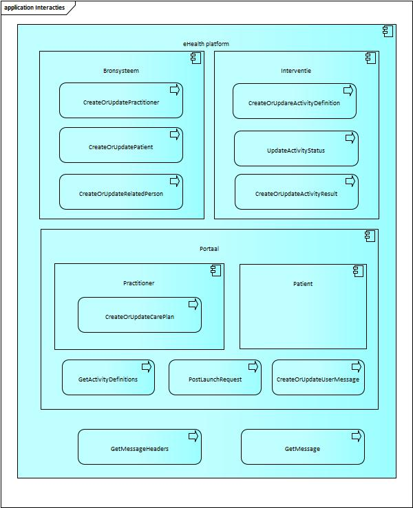
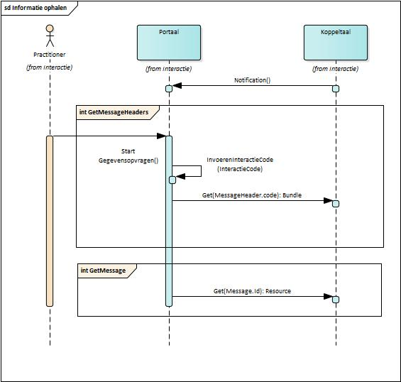
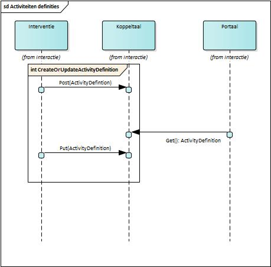
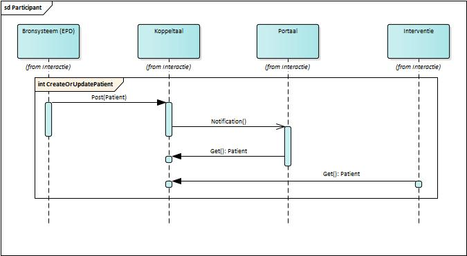
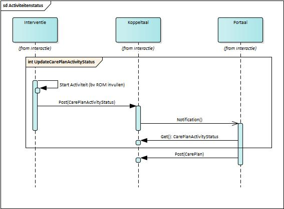
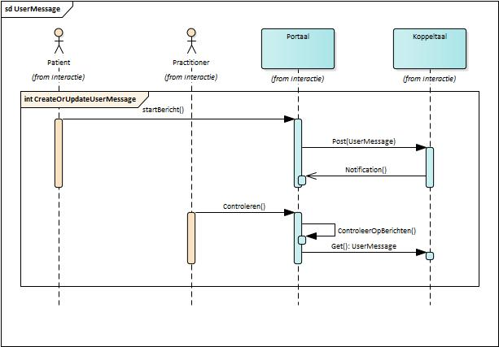
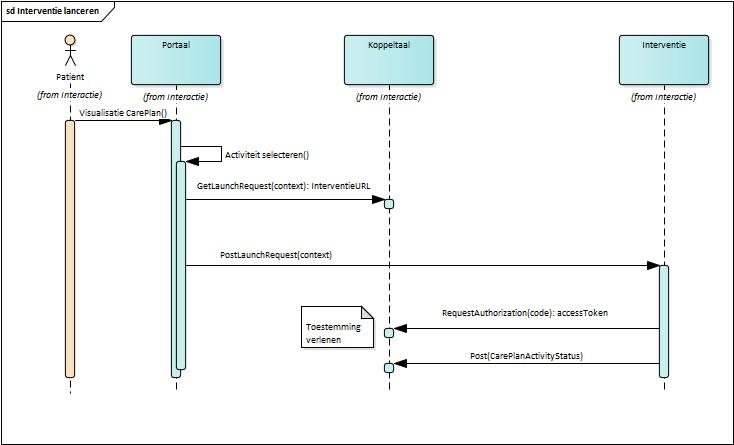

# Informatiesystemen architectuur

## Koppeltaal

### Domein en Applicatie

In de doelstelling van stichting Koppeltaal is middels het woord ‘interne’ een beperking voor de gegevensuitwisseling opgenomen. Met deze beperking wordt bedoeld dat de gegevensuitwisseling altijd plaatsvindt onder de verantwoordelijkheid van één **zorgaanbieder.** In de Koppeltaal architectuur is daarom gekozen voor het concept **domein.** Een domein, in Koppeltaal, is synoniem aan een zorgaanbieder, en beperkt de gegevensuitwisseling tot _interne gegevensuitwisseling_ onder verantwoordelijkheid van de betreffende zorgaanbieder. 

De gegevensuitwisseling vindt plaats tussen applicaties. In Koppeltaal staat het begrip **applicatie** voor alle vormen van eHealth platformen en informatiesystemen \(zoals portalen, interventie- en bronsystemen\) die voor de zorgaanbieder relevant zijn om gegevens tussen uit te wisselen, in de context van blended care behandelingen. 

Aan de hand van de gebruikte credentials die een applicatie gebruikt wordt bepaald in welk domein de gegevens worden uitgewisseld.

De volgende type applicaties onderscheiden we waarmee zorgaanbieders hun informatiesystemen naadloos op elkaar willen aansluiten binnen Koppeltaal.

Een **eHealth platform** is een \(elektronisch\) platform waar participanten \(betrokkenen\) in de zorg op een veilige en efficiënte manier informatie \(inclusief persoonsgegevens\) ‘_over’_ een behandeling kunnen uitwisselen en interventies kunnen gebruiken en uit kunnen voeren voor gebruik ‘_in’_ een \(blended care\) behandeling.

Een **portaal** is een toegangspoort of vertrekpunt voor verder navigatie tot geselecteerde bronnen die over een bepaald onderwerp gaan. Binnen Koppeltaal kunnen cliënten \(_patiënten_\), _behandelaars_, en _derden_ toegang krijgen tot functionaliteiten ‘over’ een behandeling en interventies voor gebruik ‘in’ een behandeling. Dit zijn tevens de drie verschillende typen portalen.

Een **interventie** \(systeem\) is een doelbewuste ingreep of een ondersteunend systeem bij een bepaalde behandeling. Het is op meerdere gebieden van toepassing en het hangt dan ook sterk af van de context waarin het wordt geplaatst. Binnen Koppeltaal hebben we 3 soorten interventies gedefinieerd, namelijk: ‘Game’, ‘E-Learning’ en ‘ROM’. Deze interventies zijn zelfstandige applicaties die onderdeel kunnen zijn van een behandeling.

Een **bronsysteem** is het systeem waar gegevens voor de eerste keer \(en eenmalig\) wordt vastgelegd en is in een automatiseringsproces altijd leidend. Dat betekent dat als de informatie in het bronsysteem niet juist is, dat deze informatie in de rest van de omgeving ook niet juist kan zijn. Een goed uitgewerkt en uitgedacht functioneel proces is hierbij heel belangrijk. We maken in Koppeltaal gebruik van de volgende brongegevens: patiëntgegevens \(_**EPD**_\) en gegevens over de zorgaanbieders, zoals de betrokken zorgverleners. Het EPD voor de Praktijk Ondersteuner Huisarts \(POH\) voor de GGZ \(POH-GGZ\), is het Keteninformatiesysteem \(_**KIS**_\). Ook deze applicaties worden via Koppeltaal geïntegreerd met eHealthplatforms en interventies.

Naast de beschreven applicaties, gebruiken GGZ-instellingen nog een veelheid aan andere type applicaties, waaronder Elektronische Voorschrijfsystemen \(EVS\), Kantoorautomatisering, etc. Deze applicaties vallen buiten de scope van Koppeltaal.

eHealth platformen en de verschillende informatiesystemen, zoals hierboven beschreven, worden geleverd door verschillende \(ICT\) **leveranciers.** Deze leveranciers gebruiken Koppeltaal om verschillende zorginhoudelijke processen te ondersteunen rond het inzetten van digitale interventies en gegevens uit te wisselen via interacties onder de verantwoordelijkheid van een zorgaanbieder.

**Koppeltaal** zorgt voor een collectief applicatiegedrag uitgevoerd door onderling samenwerking tussen applicaties, onafhankelijk van de gekozen leveranciers, zodat deze ingezet kunnen worden voor blended care behandelingen. Koppeltaal biedt hierbij een uitwisselingsmogelijkheden doormiddel van FHIR basis resources die met behulp van profielen uitgebreid en specifieker gemaakt worden voor een specifieke toepassing.

Dienstverleners zullen onderling nadere afspraken moeten maken over de gebruikte profielen, onder de regie van Koppeltaal. Verder biedt Koppeltaal een platform aan, waar interventies gelanceerd kunnen worden. Koppeltaal is niet strikt gebonden aan één specifieke werkwijze van de zorgverlener.

### Actoren en rollen

Zoals in paragraaf "[Domein en Applicatie](https://stibbe.gitbook.io/koppeltaal-1-3-x-architectuur/informatiesystemen-architectuur#domein-en-applicatie)" beschreven is, zijn er verschillende type applicaties betrokken ter ondersteuning van een interactief zorgproces. Bij het inrichten van deze zorgprocessen is de verdeling van verantwoordelijkheden van belang. Hierbij maken we onderscheid tussen actoren en rollen. Actoren vertegenwoordigen personen of organisatorische eenheden, rollen vertegenwoordigen verantwoordelijkheden. Verschillende rollen kunnen worden toegekend aan een actor.

Elk type applicatie kan één of meerdere \(applicatie\) functie rollen vervullen in de context van blended care.

De actoren die in de verschillende use-cases \(zie paragraaf "[Use-cases](https://stibbe.gitbook.io/koppeltaal-1-3-x-architectuur/bedrijfsarchitectuur#use-cases)"\) ter sprake komen zijn:

* **Beheerder** – Een persoon die wijzigingen kan aanbrengen die van invloed zijn op andere gebruikers van een systeem.
* **Patiënt** – Een persoon aan wie medische hulp wordt verleend.
* **Behandelaar** – Een persoon die medische handelingen of activiteiten verricht.
* **Derde** – Een persoon die een bepaalde relatie met een Patiënt heeft ter ondersteuning van een medische behandeling.

We onderscheiden de volgende rollen \(functionele verantwoordelijkheden\).

Aan de kant van de zorgverlener voor het behandelaar/zorgteam portaal hebben we de rol: **Practitioner Portal**

Aan de kant van de cliënt in het zorgproces hebben we de rollen: **Patient Portal** en **RelatedPerson Portal**

Bij de Interventies \(zelfstandige applicaties\) die onderdeel uitmaken van een behandeling hebben we drie rollen: **Game**, **E-Learning** en **ROM**

Bij bronsystemen hebben we de rol: **EPD**

Zowel interventies als bronsystemen kunnen in andere applicatie typen \(zie Portal types\) geïntegreerd worden, als onderdeel van een blended care behandelplan.

Voor het beheer, zoals de registratie en configuratie van de portalen, interventies en bronsystemen, hebben we de rol: **Koppeltaal Support**.

## Gegevensmodel

De gegevensuitwisseling gebeurt via berichtenuitwisseling en is gebaseerd op een aantal standaarden: met name HTTP, **HL7 FHIR DSTU 1\(v0.0.82\)** en relevante onderdelen van de HL7 standaard.

De kern van FHIR wordt gevormd door herbruikbare bouwstenen, de zogenaamde **FHIR resources**, waarmee oplossingen voor _uitwisseling van_ zorginhoudelijke _gegevens_ kunnen worden gebouwd. Elk bericht heeft een \(interactie\) type en hiermee kan bepaalde functionaliteit gerealiseerd worden binnen Koppeltaal \(zie paragraaf [Interacties](https://confluence.vzvz.nl/display/AK/Interacties)\).

Koppeltaal heeft een set berichten gedefinieerd waarmee de Koppeltaal use-cases kunnen worden afgedekt. Logische voorwaarde is dat de betrokken applicaties de benodigde berichten ondersteunen \(d.w.z. de structuur van de berichten kennen en de inhoud volledig kunnen interpreteren\). In de praktijk zien we dat verschillende applicaties, zoals portalen, interventies, platformen en EPD’s in Koppeltaal gecombineerd worden.

Omdat Koppeltaal gebruik maakt van FHIR DSTU1 zijn er bepaalde \(Koppeltaal\) resource concepten die niet gedefinieerd zijn voor FHIR of die buiten het interessegebied van HL7 liggen. Hiervoor gebruiken we de _Other_ resource, zodat we ook met specifieke Koppeltaal resources kunnen omgaan.

### MessageHeader

Koppeltaal v1.3.x is gebaseerd op FHIR messaging. Dat wil zeggen dat elk verzoek bericht verzonden wordt van een bron naar een bestemming, wanneer er een gebeurtenis \(event\) plaatsvindt. Het verzoekbericht bestaat uit een bundel die wordt geïdentificeerd door het type "bericht", waarbij de eerste resource in de bundel altijd een **MessageHeader** resource is. De MessageHeader bron heeft een code - interactie - die de aard van het verzoekbericht identificeert, en het draagt ​​ook aanvullende metagegevens van het verzoek mee.

De ontvanger van het bericht verwerkt het verzoek en retourneert eventueel een antwoordbericht met het resultaat van de verwerking van het bericht en eventuele aanvullende response resources die hierbij nodig zijn.

### CarePlan

Het **CarePlan** is \(nu\) de meest gebruikte resource, binnen Koppeltaal 1.3.x. Het CarePlan wordt als raamwerk gebruikt \(en is een extractie of een vertaling van een behandelplan\) om een blended care behandeling op te starten en te volgen. Hierin worden activiteiten \(of taken\), die in het kader van de zorg, aan één patiënt toegewezen. Een activiteit bevat een cruciale referentie naar de [ActivityDefintion ](informatiesystemen-architectuur.md#activitydefinition)op welke deze is gebaseerd, dit is nodig om te weten welke activiteit door Koppeltaal uitgevoerd moet worden. Verder worden de betrokkenen \([participanten](informatiesystemen-architectuur.md#participant)\) bij de behandeling in het CarePlan vastgelegd.

### Participant

Participanten betrokken bij een behandeling, kunnen verschillende rollen hebben. Verder kunnen participanten uit meerdere disciplines bestaan die in een behandelteam zijn gegroepeerd. De volgende participanten onderscheiden we:

* **Patient** \(patiënt\) die de zorg ontvangt of krijgt door de activiteiten uit te voeren, dat onderdeel is van een behandeling.
* **Practitioner** \(Behandelaar\) die direct of indirect betrokken is bij de behandeling en het behandelplan opstelt. De behandelaar vertegenwoordigt een organisatie \(**Organization**\).
* **RelatedPerson** is familie, vrienden of ervaringsdeskundigen die zijn uitgenodigd om mee te denken over de inhoud van de behandeling.
* **CareTeam** \(behandelteam\) is een groep deskundigen en/of behandelaars die uit meerdere disciplines bestaan en die ingezet kunnen worden bij een behandeling. Het Careteam vertegenwoordigt een organisatie \(**Organization**\).

### ActivityDefinition

ActivityDefinition maakt het mogelijk aan de hand van een bepaalde activiteit definitie deze uit te kunnen gaan voeren, onafhankelijk van de uitvoercontext van een bepaalde patiënt of behandelaar. Elke activiteit is gekoppeld aan één **Application** \(**Device**\) en een applicatie kan één of meerdere activiteiten ondersteunen.

### CarePlanActivityStatus

**CarePlanActivityStatus** beschrijft in detail de status en voortgang van een activiteit.

### CarePlanActivityResult

**CarePlanActivityResult** beschrijft de uitkomst van een activiteit, inclusief gegeven antwoorden en berekende scores. Het verzamelt en groepeert observaties en kan verwijzingen maken naar vragenlijsten die de antwoorden bevatten op vragen die zijn ingevoerd door een participant.

### UserMessage

**UserMessage** wordt gebruikt om informatieberichten uit te kunnen wisselen tussen participanten.

## Interacties

In deze paragraaf worden de verschillende interacties beschreven tussen de verschillende applicaties. Het doel van deze paragraaf is de toepassing van Koppeltaal voor de verschillende use-cases weer te geven, alsmede de vereisten en aanpassingen in Koppeltaal toe te lichten.

Er zijn verschillende applicatie leveranciers betrokken ter ondersteuning van een interactief zorgproces en deze zullen gecertificeerd en geregistreerd moeten worden. Het registratie proces, welke applicaties gebruik willen maken van Koppeltaal, is een \(handmatig\) configuratie proces. Indien betrokken applicatie leveranciers onderling informatie willen uitwisselen, zullen ze in hetzelfde domein aangemeld en geregistreerd moeten worden. Dit registratie proces worden door Koppeltaal Support uitgevoerd.

Na het registratie proces kan begonnen worden met de uitwisseling van informatie \(FHIR resources\), dit gebeurt via voor gedefinieerde interacties tussen de geregistreerde applicaties. Elke interactie \(tussen applicaties\) bestaat uit een FHIR MessageHeader, gevolgd door andere FHIR resources \(zie paragraaf "[Gegevensmodel](https://stibbe.gitbook.io/koppeltaal-1-3-x-architectuur/informatiesystemen-architectuur#gegevensmodel)"\). Een codering in de MessageHeader geeft aan om wat voor soort interactie het gaat. Per type applicatie zijn er verschillende interacties beschikbaar.

In de interactie laag wordt er niet meet over een cliënt gesproken maar hanteren we de term patiënt.

### Use-case versus interacties 

In het volgende overzicht ziet men met welke interacties de verschillende use-cases ondersteund. De verschillende interacties realiseren de huidige functionaliteit van Koppeltaal.

<table>
  <thead>
    <tr>
      <th style="text-align:left"><b>Use-case</b>
      </th>
      <th style="text-align:left"><b>Interactie</b>
      </th>
      <th style="text-align:left"><b>Omschrijving</b>
      </th>
    </tr>
  </thead>
  <tbody>
    <tr>
      <td style="text-align:left">
        
UC-KT-01

        
Applicatie registreren

      </td>
      <td style="text-align:left">-</td>
      <td style="text-align:left">Applicatie per zorgbehoefte geregistreerd in het Koppeltaal domein. Hier
        zijn geen interacties tussen systemen voor gedefinieerd, maar moet handmatig
        door een beheerder (Koppeltaal Support) geconfigureerd worden.</td>
    </tr>
    <tr>
      <td style="text-align:left">
        
UC-KT-02

        
(Sub)activiteiten registreren

      </td>
      <td style="text-align:left">CreateOrUpdateActivityDefinition</td>
      <td style="text-align:left">Elke interventie moet tenminste &#xE9;&#xE9;n activiteit hebben geregistreerd
        en kan aangepast danwel uitgebreid worden</td>
    </tr>
    <tr>
      <td style="text-align:left">
        
UC-KT-03/

        
UC-KT-04/

        
UC-KT-09

        
Behandelplan starten

      </td>
      <td style="text-align:left">CreateOrUpdateCarePlan GetMessage(Headers)</td>
      <td style="text-align:left">Na een intake wordt er een behandelplan opgesteld en activiteiten toegekend
        aan een pati&#xEB;nt. Nadat activiteiten toegekend zijn wordt pati&#xEB;nt
        genotificeerd via inlogverzoek. Dit behandelplan draagt bij voor een ge&#xEF;ntegreerd
        pati&#xEB;ntenbeeld tussen zorgverlener en pati&#xEB;nt.</td>
    </tr>
    <tr>
      <td style="text-align:left">
        
UC-KT-05

        
Interventie lanceren

      </td>
      <td style="text-align:left">PostLaunchRequest</td>
      <td style="text-align:left">OAuth 2.0 standaard en SMART-on-FHIR voorschriften.</td>
    </tr>
    <tr>
      <td style="text-align:left">
        
UC-KT-06

        
Voortgang monitoren

      </td>
      <td style="text-align:left">UpdateCarePlanActivityStatus GetMessage(Headers)</td>
      <td style="text-align:left">Voortgang en status van een activiteit delen en ontvangen van een interventie.
        Een interventie is aan een behandelplan gerelateerd.</td>
    </tr>
    <tr>
      <td style="text-align:left">
        
UC-KT-07

        
Activiteit evalueren

      </td>
      <td style="text-align:left">CreateOrUpdateCarePlanActivityResult GetMessage(Headers)</td>
      <td style="text-align:left">Uitslagen en resultaten delen en ontvangen van een interventie</td>
    </tr>
    <tr>
      <td style="text-align:left">
        
UC-KT-08/

        
UC-KT-10

        
Gebruikers aanmaken

      </td>
      <td style="text-align:left">CreateOrUpdatePatient CreateOrUpdatePractitioner CreateOrUpdateRelatedPerson
        GetMessage(Headers)</td>
      <td style="text-align:left">Verschillende typen gebruikers kunnen worden aangemaakt. Na opvoeren van
        een gebruiker worden alle ge&#xEF;nteresseerde applicaties gesynchroniseerd
        en kunnen andere applicaties de gegevens aanvullen.</td>
    </tr>
    <tr>
      <td style="text-align:left">
        
UC-KT-11

        
Informatie uitwisselen

      </td>
      <td style="text-align:left">CreateOrUpdateMessage GetMessage(Headers)</td>
      <td style="text-align:left">Algemene informatie delen en ontvangen tussen participanten</td>
    </tr>
  </tbody>
</table>

### Informatie zoeken en ophalen

Koppeltaal heeft voor elke applicatie een bestemmingsqueue waarin de gegevens \(tijdelijk\) worden opgeslagen, die nog niet door de betreffende applicatie is opgehaald en verwerkt. Hierdoor hoeven applicaties niet continue en direct in verbinding te staan met andere applicaties. Elke geregistreerde applicatie kan op elk moment Koppeltaal bevragen met de specifieke GET \(opvragen\) API aanroep \(HTTP operatie\) of er berichten klaar staan met een bepaalde MessageHeader code, status of patiënt dossier \(de GetMessageHeaders interactie\). Koppeltaal stuurt op deze specifieke aanvraag een bundel met MessageHeaders terug naar de betreffende applicatie die matchen met het verzoek. Vervolgens kan de berichtinhoud aan de hand van de MessageHeader.Id opgehaald worden \(de GetMessage interactie\). Bij deze interactie wordt er geen gebruik gemaakt van een MessageHeader omdat er geen communicatie is tussen applicaties.

#### Notificeren

Om het bevragen van Koppeltaal te ontlasten, biedt Koppeltaal een functie aan om notificaties \(notification\) te versturen naar applicaties, binnen een domein. Hiermee halen de applicaties pas gegevens op als de gegevens bij Koppeltaal, in de bestemmingsqueue van de te ontvangen applicatie, klaar staan. Het is aan de applicatie leveranciers de keuze of ze hiervan gebruik willen maken. Tijdens het registratie proces van de applicaties, kan dit per applicatie geconfigureerd worden om een notificatie te willen ontvangen van Koppeltaal. Elke applicatie kan via een abonnement aangeven, in welke interacties hij geïnteresseerd is. Voor Koppeltaal 1.3.x wordt dit door de beheerder van Koppeltaal Support ingevoerd.

### \(Sub\)activiteiten registreren en lezen

Koppeltaal bevat een applicatie register dat de definities registreert van activiteiten van een interventie. Deze worden aangemeld middels de interactie CreateOrUpdateActivityDefinition welke via het certificeringsproces getest zijn op een goede en passende werking binnen Koppeltaal. De structuur van de activiteiten definities wordt gerepresenteerd door een lijst van sub-activiteiten die horen bij deze interventie \(bijv. level in een game, sectie van een ROM-vragenlijst, etc.\). Het proces van het creëren of wijzigen van de activiteiten definities is via een POST \(creëren\) of PUT \(wijzigen\) API voor elke ActivityDefinition aanroep door de interventie \(applicatie instantie\) mogelijk. Het wijzigen van de definities zal niet in nieuwe activiteiten resulteren.

De activiteiten definities kunnen worden opgevraagd met een specifieke GET \(opvragen\) API aanroep. Deze aanroep biedt de Activity Definities aan die beschikbaar worden gesteld door de interventie. Deze Activity Definities kunnen gebruikt worden door een CarePlan \(via CarePlan.activity\).

### Aanmaken CarePlan

Na een intake wordt er een CarePlan aangemaakt. Een CarePlan is een \(FHIR resource\) extractie \(uittreksel\) of een vertaling van een behandelplan. Hierin worden de activiteiten vastgelegd.

Een CarePlan is gemaakt door een behandelaar voor een patiënt. De patiënt is standaard de uitvoerder van het CarePlan. Een CarePlan wordt aangemaakt middels de interactie CreateOrUpdateCarePlan met CarePlan als FocalResource.

Een CarePlan bevat één of meer activiteiten die door de patiënt kunnen worden uitgevoerd. Zowel op niveau van het CarePlan als op het niveau van een Activity \(activiteit\) kunnen Practitioner \(behandelaar\) en RelatedPerson \(derde\) resources zijn gelinkt via het element participant in het CarePlan.

Binnen Koppeltaal 1.3.5.is het CareTeam geïntroduceerd. Het is de verwachting dat Practitioner resources, in toekomstige versies van Koppeltaal, gelinkt zullen worden aan een CareTeam. Deze worden nu aan het CarePlan gelinkt.

Als een CarePlan aan een patiënt is toegewezen zijn alle geselecteerde activiteiten direct toegankelijk voor de patiënt. De relatie tussen de patiënt en behandelaar is gemaakt via het CarePlan \(en impliciet via de activiteiten daarin\).

### Participanten opvoeren en uitwisselen

Om de synchronisatie van een Participant bij een behandeling tussen applicaties binnen een domein mogelijk te maken, zijn er de volgende interacties gedefinieerd: CreateOrUpdatePatient met Patient als FocalResource, CreateOrUpdatePractitioner met Practitioner als FocalResource en CreateOrUpdateRelatedPerson met RelatedPerson als FocalResource.

Het doel van deze synchronisatie is om de identificatie van een participant \(patiënt, derde of behandelaar\) gelijk te trekken tussen alle applicaties binnen een domein. De identificatie van de participanten is in Koppeltaal één van de bouwblokken voor het kunnen starten van interventies.

Als voorbeeld, een nieuwe patiënt wordt ingeschreven in het EPD \(bronsysteem\) en zal een set van acties triggeren:

* het maken van een CreateOrUpdatePatient interactie voor de nieuwe patiënt
* het posten van de Patient \(resource\) gegevens
* het notificeren van geabonneerde applicaties
* het ophalen van de Patient \(resource\) gegevens bij Koppeltaal
* de verdere \(lokale\) afhandeling binnen de applicaties \(Portaal, Interventie, etc.\) om een account voor deze gebruiker te kunnen regelen en de gebruiker ID te koppelen

### Activiteit monitoren en evalueren

Er kan een set van interacties gebruikt worden om de status van een activiteit binnen een behandelplan actueel te houden en deze vervolgens te kunnen monitoren.

* De CreateOrUpdateCarePlan interactie: Deze interactie bevat de informatie over het behandelplan en initieert de status van het plan. Als een behandelaar \(Practitioner resource\) een of meerdere activiteiten toewijst aan een patiënt \(Patient resource\), wordt een CarePlan resource gemaakt met de aangegeven activiteiten en de status wordt op ‘Available’ \(beschikbaar\) gezet. Er kunnen daarnaast activiteiten toegewezen worden aan derden \(RelatedPerson resource\).
* De UpdateCarePlanActivityStatus interactie: Deze interactie wordt gebruikt om de status van activiteiten binnen het behandelplan up-to-date te houden met CarePlanActivityStatus als FocalResource. Merk op dat een statuswijziging van één CarePlanActivity een statusverandering in een andere CarePlanActivity kan veroorzaken. Als een CarePlanActivity bijvoorbeeld afhankelijk is van een andere, kan het beëindigen van een CarePlanActivity ertoe leiden dat afhankelijke CarePlanActivities beschikbaar komen. Als er meerdere partijen betrokken zijn bij een behandelplan, zullen er meerdere activiteiten per partij binnen het behandelplan aangemaakt zijn.
* Zodra een CarePlanActivity beschikbaar is, kunnen er resultaten worden gegenereerd en geëvalueerd. Resultaten worden gecommuniceerd met behulp van de CreateOrUpdateCarePlanActivityResult  interactie, met CarePlanActivityResult als FocalResource. Resultaten kunnen tussentijdse resultaten zijn en als zodanig onderhevig zijn aan veranderingen.

Wanneer de patiënt of gerelateerde persoon bijvoorbeeld begint met het uitvoeren van een activiteit uit een behandeling \(CarePlanActivity\), verandert zijn status van 'beschikbaar' in 'in uitvoering'.

Vervolgens wordt de interactie UpdateCarePlanActivityStatus verzonden met de CarePlanActivity waarvan de status is gewijzigd. Dit is bedoeld om de applicatie die eigenaar is van het CarePlan op de hoogte te stellen van de verandering in status. De verantwoordelijke toepassing kan vervolgens beurtelings een interactie CreateOrUpdateCarePlan verzenden om alle toepassingen die geïnteresseerd zijn in het CarePlan als geheel \(in plaats van specifieke activiteiten in het CarePlan\) op de hoogte te stellen van de wijziging.

### Informatie uitwisselen

Informatie berichten tussen participanten wordt gebruikt om eenvoudige ongestructureerde informatie uit te kunnen uitwisselen. Dit gebeurt via de [CreateOrUpdateUserMessage]() met UserMessage als FocalResource. Deze berichten bevatten alleen tekst.

Merk op dat een user bericht niet als notificatie bericht gebruikt wordt.

Als voorbeeld, een patiënt heeft een specifieke vraag over een behandeling aan een behandelaar. Dit zal de volgende acties triggeren:

* het maken van een CreateOrUpdateUserMessage interactie voor de patiënt
* het posten van de UserMessage \(resource\) gegevens
* het notificeren van geabonneerde informatie systemen \(Practitioner Portaal\)
* het ophalen van de UserMessage \(resource\) gegevens bij Koppeltaal door de behandelaar. Het ophalen van de UserMessage gebeurt via 5.1 Informatie zoeken en ophalen.

### Het lanceren van een interventie

Het lanceren van een interventie gaat volgens de OAuth 2.0 standaard en SMART-on-FHIR voorschriften. Na het aanmaken van een CarePlan met één of meer activiteiten door een behandelaar voor een patiënt, kan de patiënt deze activiteiten in zijn portaal \(eigen omgeving binnen de context van een zorginstelling\) starten door een interventie te lanceren. Hiervoor gebruikt de patiënt een unieke interventie adres \(URL\) die in het portaal wordt klaargezet. Zodra de patiënt deze URL opent wordt de patiënt via Koppeltaal naar de interventie geleidt binnen de context van een behandeling \(zie PostLaunchRequest\). De interventie ontvangt de context van de LaunchRequest en een Autorisatie endpoint waarmee hij om toegang tot de gegevens vraagt bij Koppeltaal. Koppeltaal geeft de interventie vervolgens een access token waarmee de interventie vervolgens Koppeltaal kan updaten over de voortgang van bepaalde activiteiten die door een participant wordt uitgevoerd. Als de acces token verlopen is kan de interventie om een refresh token vragen.

